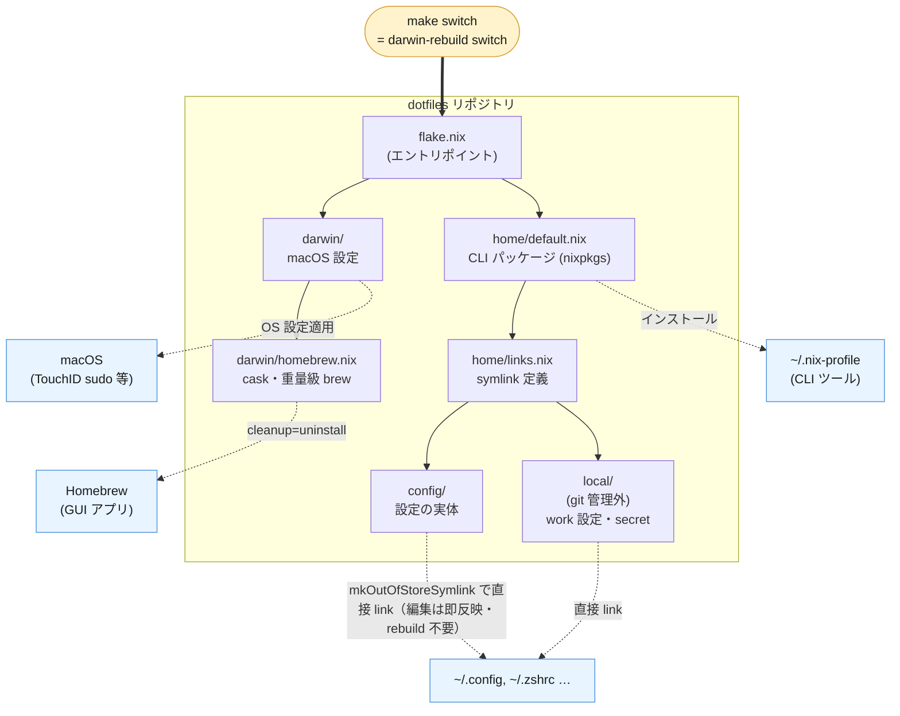

# dotfiles

nix-darwin + home-manager による個人開発環境設定です。


## 構成

- **flake.nix** — エントリポイント（nixpkgs / nix-darwin / home-manager）
- **darwin/** — macOS システム設定と Homebrew（taps / brews / casks）の宣言的管理
- **home/** — home-manager。`config/` 配下の設定ファイルを symlink（`mkOutOfStoreSymlink`）
- **config/** — nvim / tmux / zsh / starship 等の実体。**編集は即反映（rebuild 不要）**
- **local/** — git 管理外。work の git identity・社内 URL 等のマシンローカル設定



- **`.nix` を変更したとき**は `make switch` で反映（パッケージ・OS 設定・symlink 構成が更新される）
- **`config/` 配下の設定ファイル**は repo を直接 symlink しているため、編集するだけで即反映（rebuild 不要）

設計の詳細と移行計画は [docs/design.md](docs/design.md) を参照。

## セットアップ（新しい Mac）

### ワンライナー

Xcode CLT / Homebrew / Nix / clone / 初回適用までを bootstrap スクリプトが冪等に実行します。

```bash
curl -fsSL https://raw.githubusercontent.com/yuucu/dotfiles/main/scripts/bootstrap.sh | bash
```

途中 Xcode CLT のインストールと `sudo` のパスワード入力で対話が入ります。何度実行しても既存分はスキップされます（冪等）。処理内容は [scripts/bootstrap.sh](scripts/bootstrap.sh) を参照。

### 手動セットアップ（中身を把握したいとき）

```bash
# 1. Xcode CLT と Homebrew（brew 管理のパッケージ用）
xcode-select --install
/bin/bash -c "$(curl -fsSL https://raw.githubusercontent.com/Homebrew/install/HEAD/install.sh)"

# 2. Nix のインストール（Determinate Systems installer）
curl -fsSL https://install.determinate.systems/nix | sh -s -- install --no-confirm

# 3. clone
mkdir -p ~/ghq/github.com/yuucu
git clone https://github.com/yuucu/dotfiles ~/ghq/github.com/yuucu/dotfiles
cd ~/ghq/github.com/yuucu/dotfiles

# 4. flake.nix の username / darwinConfigurations 名をそのマシンに合わせて確認

# 5. 適用（初回。dotfiles の symlink と brew パッケージ一式が入る）
sudo nix run nix-darwin/master -- switch --flake .#yuucu-mac

# 6. 以降の適用
make switch
```

### 適用後の手作業（最小限）

1. **`local/` の作成**（git 管理外。ないと `~/.gitconfig` 等の symlink が空振りする）
   - `local/gitconfig` … 本体。identity と `[include] path = ~/.gitconfig.local` など
   - `local/gitconfig-personal` … 個人用 identity（`includeIf` で `~/ghq/github.com/yuucu/` 配下に適用）
   - `local/gitconfig.local` / `local/zshrc.local` … work 固有の URL 書き換えや関数
2. シェルを開き直す … zinit・プラグインは初回起動時に自動インストールされる
3. `mise install` / `gh auth login` などツール個別のログイン

## よく使うコマンド

| コマンド | 説明 |
|---------|------|
| `make switch` | flake の変更をシステムに適用 |
| `make check` | 適用せずに評価チェック（shell / lua / nix の lint 込み） |
| `make update` | flake inputs・Neovim プラグイン・mise の更新（check が通ってから switch） |
| `make fmt` | nix ファイルの整形（`nix fmt`） |
| `make gc` | 30 日より古い世代の削除と Nix store の GC |
| `make ci-check` | CI と同じチェック（flake check + build dry-run + 全履歴 gitleaks） |
| `make hook-install` | lefthook の git hook を有効化 |
| `make status` | 環境の状態確認 |

lint ツール（shellcheck / stylua / nixfmt / statix / deadnix）は flake の `checks` に組み込まれており、CI・ローカルとも flake.lock で固定された同一バージョンを使います。単発で使いたい場合は `nix develop` で devShell に入れます。

git hook（lefthook）は CI との重複を避け、軽いチェックだけを担当します。`pre-commit` は staged ファイルの lint（shellcheck / stylua）と gitleaks（staged のみ）、`pre-push` は `nix flake check`（lint 群の最終確認）を実行します。重い build dry-run と全履歴 gitleaks は GitHub Actions に任せ、ローカルで完全再現したいときは `make ci-check` を使います。

`config/` 配下（nvim 設定など）の編集は symlink 経由で即反映されるため、`make switch` は不要です。ファイルの追加・削除・link 先の変更をしたときだけ `make switch` を実行します。

## ライセンス

MIT License
